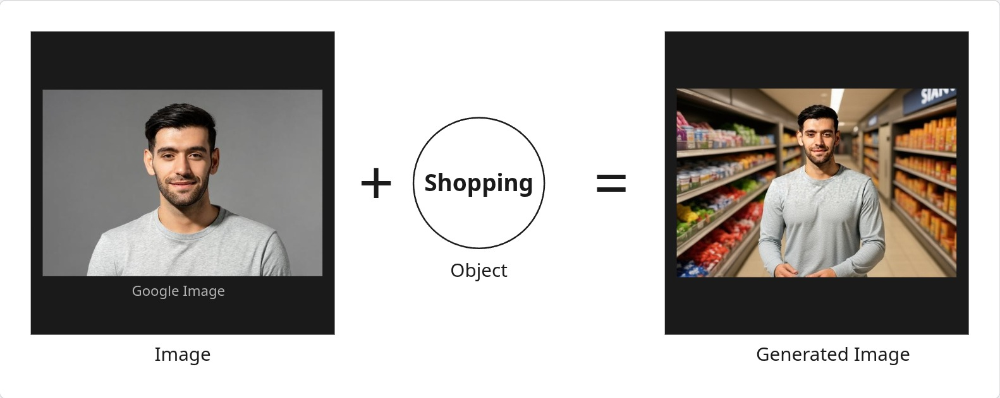
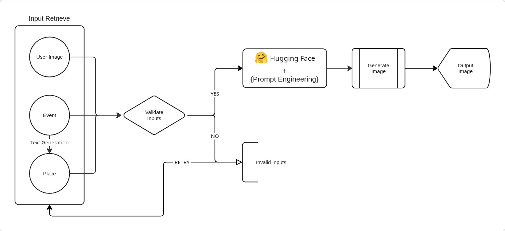

## Object & Image to Image Generation

### Model Inputs

**Image** - Image of the user

**Object** - The plan activity of the user (eg. Cricket, Movie, Shopping, etc.)



---

### API Endpoints

- ``` GET /health ``` - Check if the server is functioning properly.

- ``` POST /upload ``` - Here user have to give their inputs.

---

### Workflow



---

### Environment Setup
```bash
pip install -r requirements.txt
```

```bash
$ cp .env.example .env
```

```python
GOOGLE_API_KEY=your_google_api_key

HF_TOKEN=your_huggingface_token
```
Make sure you have granted the 'Make calls to Inference Providers' privilege to your access tokens generated through HF.

---

### Run Cmd

$ flask run

---

### Postman Query

Body -> form-data

```
Key                    Value

- image                - @attachment

- text                 - object
```